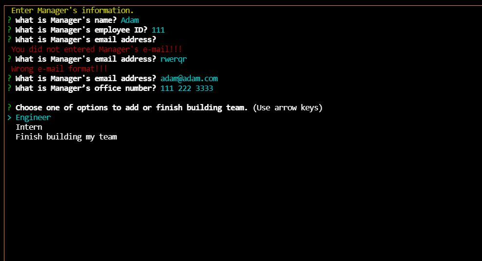
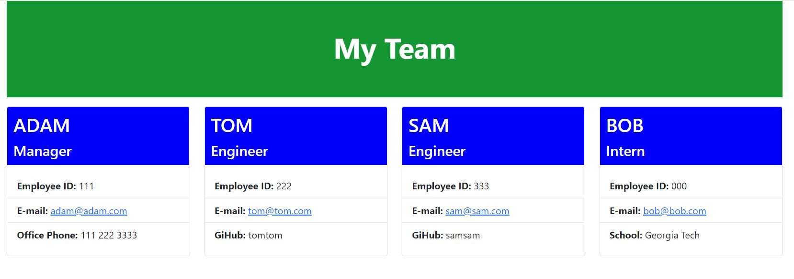

# Team Profile Generator
 [](https://opensource.org/licenses/MIT)


  ## Table of contents
  - [Description](#description)
  - [Installation instructions](#installation-instructions)
  - [Usage information](#usage-information)
  - [Test instructions](#test-instructions)
  - [License](#license)
  - [Questions](#questions)


  ## Description

  This is a Node.js command-line application that takes in information about employees on engineering team, then generates an HTML webpage that displays summaries for each person. 

  User input screenshot:
  

  HTML output file:
  


  #### Demo video

  [Team Profile Generator video demonstration](https://drive.google.com/file/d/1PN4xAaWebrhjSPdkmJKHXLnSasAgVhtp/view?usp=sharing)

  #### For this project the following technologies were used:
  * Nodejs
  * npm inquirer
  * npm jest
  * css Bootstrap


  ## Installation instructions

  For dependancies run following comand:

  ```npm i```

  ## Usage information

  To use this app - run the following command:

 ```node index```

  ## Test instructions

  For testing - run the following command:

 ```npm test```

  ## License

  [](https://opensource.org/licenses/MIT)

  Usage is provided under [The MIT License](https://opensource.org/licenses/MIT). See LICENSE for the full details.

  ## Questions

  To reach me with additional questions

  GitHub: [Juliusm9791](https://github.com/Juliusm9791)

  Email: juliusm9791@gmail.com

